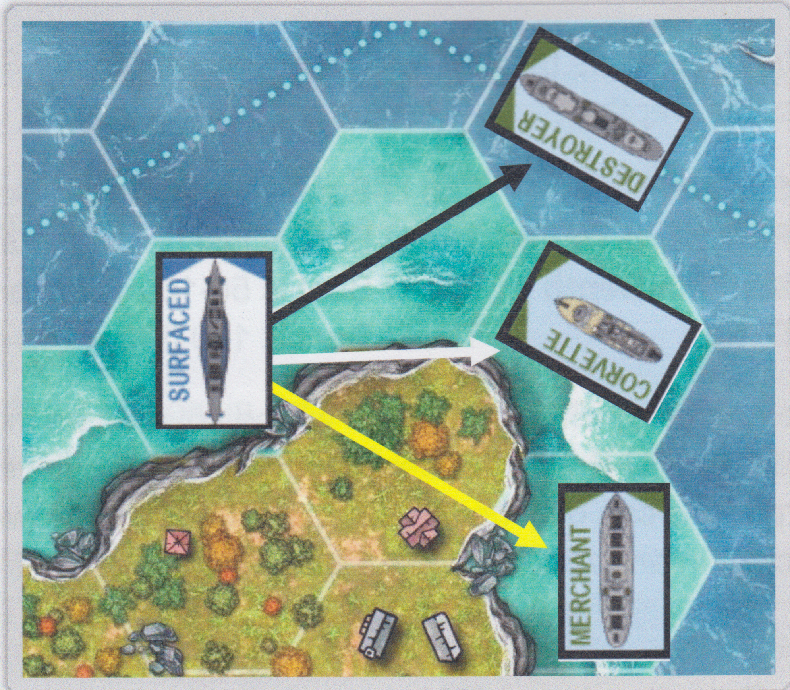
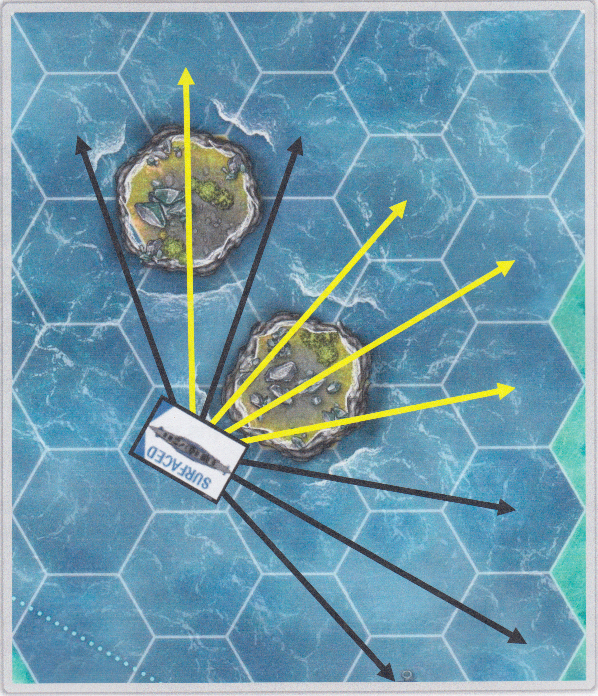
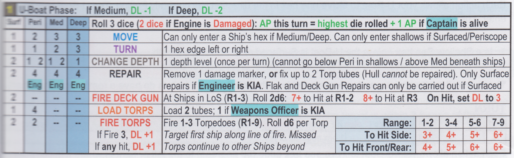
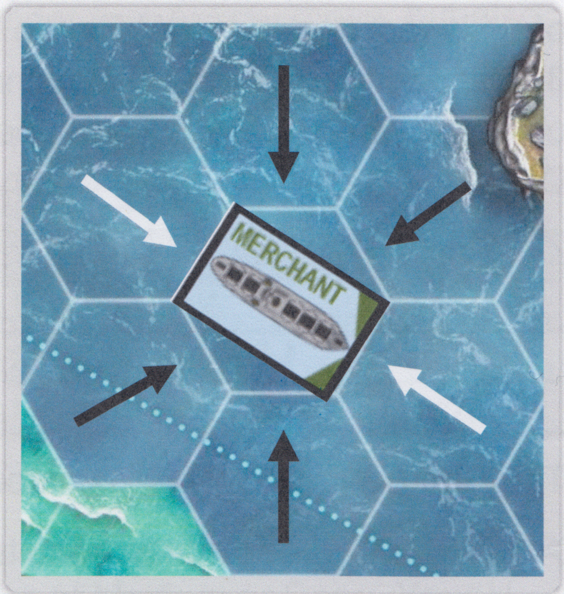
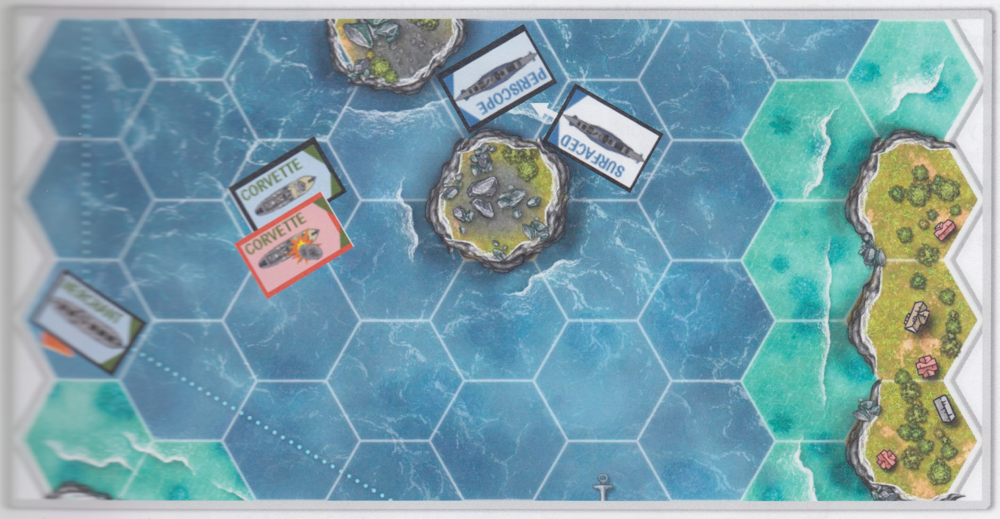

# Lone U-Boat — Rules

---

## Introduction

---

### **Background**

It is late 1942 and the seas are dangerous and frightening. Allied convoys surge across the Atlantic, bringing vital supplies to Britain and Russia. But beneath the waves, Germany’s U-Boats are on the hunt, silent and deadly.

You are the commander of a **Type VIIC U-Boat**, the backbone of the Kriegsmarine’s submarine fleet. Your mission is to intercept and destroy merchant shipping, evade aggressive escorts and survive the increasing threat of Allied air power.

Aircraft patrol the skies and escort ships roam the convoy lanes. Your deck gun may still sink a lone freighter, but surfacing risks retaliation. The decisions you make on when to hide and when to attack will be crucial to your success as a U-Boat captain.

This is a game of **stealth, timing, and nerve**. You’ll manage movement, depth, detection and damage across a range of different maps. Escorts will use sonar sweeps, depth charges and gunfire and, if you surface, the skies may bring additional dangers.

Can you complete your mission or will your U-Boat become yet another silent wreck beneath the Atlantic?

---

### **How the game works**

This is a **solitaire wargame**. You play the game, and the enemy is controlled by the game. You will need at least 6, but preferably a few more, standard six-sided dice.

It is recommended that the counters provided on the final page of the game are used to play this game (especially for the U-Boat and Ships). Simply stick them to card and cut them out. A video demonstrating how generally to do this can be found on the **Mike Lambo Games YouTube** channel.

I find that the easiest way to make these counters is to print or copy them onto an A4 printer label, leave the ink to dry completely, then peel the back and stick to 1-2mm card. I cut them out with good quality scissors. I now also spray them with a clear lacquer spray to give them some protection and a glossier feel, but that is certainly not necessary.

---

### **How to learn the game**

If you have played any of my games before then you will have some idea about how my games work, although game systems tend to vary quite a lot from game to game. Even if you haven’t played any of my games before, I’m sure you will find the rules easy to read and very comprehensive, with useful examples of play.

Whatever your experience of my games, I suggest you read the rules through once, and then watch my **“Instructional Playthrough”** video on my **Mike Lambo Games YouTube** channel just to see how it should work. However you do it, I’m sure you’ll be out there in your U-Boat soon enough!

As you read the rules, please do not be frustrated or concerned if you hit a term or phrase that does not immediately make sense or that you feel needs more explanation — it is highly likely that the particular point will be covered again in more detail later in the rules or be highlighted in an example at some point.

---

### **The Missions**

The game includes **10 Missions** based in the North Atlantic around late 1942. Each Mission has its own Map and Objectives. Missions tend to get a little more challenging as you progress, allowing you to test your newly developed skills as a U-Boat Captain.

---
---

## Key Concepts and Set Up

---

### **Objectives**

As stated above, each Mission will provide Objectives which must be completed in order to win the Mission. Always take careful note of what you have to do. You **lose immediately** if your U-Boat is **destroyed**. You do **not** lose just because all six of the key crew members referred to on each Mission Map are **Killed in Action** — there is, of course, a full crew on the U-Boat who can complete the Mission without those key crew members (although the job will be more difficult!). For clarity, you only need to do exactly what the objectives say in order to succeed in a particular Mission.

There may be other distractions on the map, such other enemy Ships or Aircraft, but these only need to be destroyed if the objectives specifically say so.

For example, here are the Objectives for Mission 1:

**Objective:** *Destroy the Merchant Ship before it exits the map, then exit the map in the direction of the red arrow.*

The Objectives here require you to destroy the Merchant Ship and then to exit the Mission Map at a particular point. There is no need to destroy any other enemy units, although of course it might help your cause if you do!

---

### **The Units**

The only unit in the game that is controlled by you is the German U-Boat. It will encounter various Allied units which are controlled by the game system itself. These units consist of Merchant Ships, Corvettes and Destroyers (Ships) and B24 Liberators (Aircraft).

---

### **Facing, Line of Sight and Range**

The **Facing** of any Unit in this game (U-Boat, Ship or Aircraft) is simply the direction the **main hull or fuselage faces out of a hex**, and this can therefore be any one of **six directions**.

Units are always placed so that they are **Facing the edge of a hex** (rather than a corner). Facing is important when it comes to deciding Movement options, Turning direction, and also some aspects of battle.

---

**Line of Sight** runs in all directions and at all angles from a Unit’s hex with no distance limitation.

Line of Sight is established by **tracing an imaginary line** from the centre of one unit’s hex to the centre of another unit’s hex and checking the hexes that the line passes through.

Attacks by Ship gunfire or U-Boat deck gun fire and other mechanisms which use this Line of Sight method are each **restricted to 3 hexes in Range** and so it is not difficult to establish Line of Sight.

*Since only Land hexes block Line of Sight in this game, Line of Sight will not often not be an issue, as many Mission Maps include significant areas of open water. For clarity, units never block Line of Sight.*

---

Line of Sight is never an issue when considering units on the **same hex** or units which are **adjacent to each other** — units always have Line of Sight to another unit on the same hex as itself or on an adjacent hex.

When units trace Line of Sight to an enemy unit which is **two hexes away**, Line of Sight is just a little more complex but still follows the basic rule with the imaginary line referred to above being drawn (centre of hex to centre of hex).

Before you reach for the ruler or laser, please be assured that these are not required! The two hexes in this situation will either be in a direct line of hexes with each other and Line of Sight will travel **through just the one hex between them**, or they will be separated by two hexes and Line of Sight will travel directly up the edge **between those two hexes** (in this latter case, always take the hex which is most favourable to the ‘observer’ unit).

Here’s an example:

---

## Range 2 Line of Sight Examples

Let’s consider some of the **‘Range 2’ Lines of Sight** of the U-Boat.

It clearly has Line of Sight to the Destroyer, as Line of Sight only passes through one intervening hex which is a Sea hex that does not block Line of Sight (black arrow). It also has Line of Sight to the Corvette (white arrow).

Now note it passes along the edge of two other hexes on its way to the Corvette’s hex. One of those hexes is a Land hex which would usually block Line of Sight. However, because the other hex is a Sea hex (which does not — favourable to the observer), Line of Sight is established.

Finally, the U-Boat **does not** have Line of Sight to the Merchant Ship (yellow arrow) because the one hex it passes through is a Land hex and that blocks Line of Sight.

**Reminders:** Although only selected Lines of Sight are shown in the diagram above, units can see in *any* direction. Remember also that Units do not themselves block Line of Sight, so for example if there was a Ship positioned between the U-Boat and the Destroyer, they would still be able to see each other.

Lines of Sight are always **reciprocal** — if a Unit A can see Unit B, then Unit B can see Unit A.

---

## Range 3 Line of Sight Examples

When units trace Line of Sight to an enemy unit which is **three hexes away**, there will **always be two (and only two)** intervening hexes and Line of Sight will always travel through **both** of those hexes. The diagram below exemplifies this.

Let’s consider some of the **‘Range 3’ Lines of Sight** of the U-Boat as shown in the diagram. Note that they all pass through exactly two intervening hexes on their way from the U-Boat to the destination hex three hexes away.

If either of those intervening hexes is a Land hex, then Line of Sight is blocked (yellow arrows). If not, then Line of Sight is established (black arrows).

It is as simple as that — just make sure you identify the correct two hexes in each case!

## Depth

Your U-Boat has the ability to Dive deeper into the Sea and to Ascend back up. In this game there are 4 possible Depths:

- **Surfaced** — The U-Boat is afloat on the Sea and therefore potentially very visible to enemies.
- **Periscope Depth** — The U-Boat is just below the surface with only the periscope visible (if at all).
- **Medium Depth** — The U-Boat is 50–100 yards or so under the surface.
- **Deep** — The U-Boat is 100–200 yards or so under the surface.

The gameplay effects of Depth will be covered as the Rules are explained below. However, as a general guide, your U-Boat is harder to detect at deeper levels, but it is easier to manoeuvre at shallower depths.

Torpedoes can only be Fired and Loaded at shallower depths and Repairs are easier when Surfaced. The Deck Gun and Anti-Aircraft Flak Gun can only be Fired when Surfaced.

---

## Detection Level

The **Detection Level (DL)** determines how much the enemy knows about the current position of the U-Boat.

There are 4 Detection Levels: 0-3 (it can never go above Level 3):

| DL | Level   | Meaning |
|---:|---------|--------|
| 0 | **Silent** | The enemy is not even sure that your U-Boat is in the vicinity. |
| 1 | **Aware** | The enemy is aware of the presence of your U-Boat but not its location. |
| 2 | **Traced** | The enemy knows more or less where your U-Boat is. |
| 3 | **Locked** | The enemy knows exactly where your U-Boat is. |

As with Depth, the gameplay effects of the Detection Level will be explained at relevant points in the Rules below.

For now, note that as the Detection Level increases, the enemy units will start to hunt you down more and become more aggressive. The difference between **DL1 and DL2** is particularly significant.

---

## Set Up

Set up for each Mission is generally very quick:

- First, place Allied Ships on those hexes with relevant initial letters on them (M for Merchant Ship, C for Corvette and D for Destroyer). Place them facing the edge of the hex where the initial letter is printed.

- Then place your U-Boat on the **‘U’** hex, facing any direction of your choosing and at any depth.

- Place a counter or marker at zero on the Detection Level track in the top left hand corner of the Mission Map.

- Place a counter or marker in each of the 5 Torpedo Tubes to indicate that they are each loaded.

- No other counters or markers need to be placed at this stage. You have a full crew and no damage.

- Always check the specific instructions at the top of the page adjacent to each Mission Map to ensure nothing alters these basic instructions for any particular Mission.

## Main Rules including the Turn Process

There is no turn limit in this game. The game proceeds through each turn as a series of **6 Phases** (some of
which are very quick or will not apply every turn). The bulk of the rules to the game can best be explained
after each Phase, making them easier to find should they be needed. As ever with *Mike Lambo Games*,
most of the key rules (or at least reminders of them) are set out in charts on the page next to each Mission
Map for ease of reference.

---

### Phase 1 — U-Boat Phase

This Phase is where you get to perform various actions with the U-Boat in order to achieve the Mission
Objectives. It revolves around the Chart found on the page opposite each Mission Map and which looks like
this:

At the top of this Chart, the first line has a reminder to check your U-Boat’s **Depth** and to adjust the current
**Detection Level (DL)** accordingly. These two concepts were introduced earlier. Here, you are checking the U-
Boat’s Depth **at the start of the U-Boat Phase** before it has performed any Actions. If your U-Boat is currently
at Medium Depth, then reduce the Detection Level by 1. If the U-Boat is currently Deep, then reduce the
Detection Level by 2. These reductions cannot take the Detection Level below zero.

Then, **roll 3 dice** (but reduce this to 2 dice if your U-Boat’s engine is damaged — damage will be covered
later). In either case, keep the one highest die rolled and discard the others. This die tells you how many
Action Points (APs) you have this turn. Finally, if your Captain is still alive and has not been Killed in Action
then you can add another 1 AP to this total. Normally therefore, your APs will be 2–7. Once you lose your
Captain, your APs will range from 1–6. Record your remaining APs as you spend them by using a d6.

You then get to *spend* those Action Points on available Actions, one at a time, and you can perform those
actions in **any order**. You can also perform Actions more than once in a turn, as long as you have the Action
Points to spend (the exception is the “Change Depth” Action which, as stated in the Chart, can only be
performed once per turn). For clarity, you do **not** have to use all or any of your Action Points but any remaining
APs are discarded and not saved or held over in any way.

There are **seven actions** which can be performed by the U-Boat. The Chart above sets out the actions and the
Action Point Cost for each action (in the four columns on the left of the Chart). Note that the Action Point Cost
varies for most Actions depending on the Depth of the U-Boat. In addition, some Actions are unavailable
altogether at certain Depths (those marked with “--”). For example, **MOVING** your U-Boat costs more APs as
you go deeper to reflect the fact that manoeuvring at depth was slower and more difficult. The same applies to
**TURNING**. The attacking Actions such as **FIRING** (the Deck Gun), and **LOADING** and **FIRING Torpedoes** can
only be done when Surfaced (in all cases) or at Periscope Depth (in the case of Loading and Firing).

## FIRE DECK GUN

Surf | Peri | Med | Deep
---- | ---- | --- | ----
2 | — | — | —

Roll 3 dice (2 dice if Engine is Damaged)  
AP this turn = **highest** die rolled **+ 1 AP if Captain is alive**

**FIRE DECK GUN** — At Ships in LOS (R1–3). Roll 2d6: **7+ to Hit at R1–2 · 8+ to Hit at R3**  
On Hit, set **DL to 3**

Each action allows your U-Boat to Fire its Deck Gun.

The Deck Gun cannot be Fired if:

- The Deck Gun is damaged, or
- The U-Boat is not Surfaced

You must:

- Select a target Ship
- Confirm it is within Range 1–3
- Confirm Line of Sight exists (Land hexes block LOS)

Facing does **not** matter when firing the Deck Gun.

Roll **2d6**:

- **7+** to Hit at Range 1–2
- **8+** to Hit at Range 3

If the target is Hit:

- Detection Level is immediately set to **DL 3**

Then roll **1d6 on the Allied Ship Damage Chart**.

---

## Allied Ship Damage Chart

For each Torpedo or Deck Gun Hit on a Ship, roll d6 for Damage:

Ship Type | 1–2 | 3–4 | 5–6
-------- | --- | --- | ---
Merchant | No significant damage | Damaged → Sunk | Catastrophic Hit → Sunk
Corvette | No significant damage | Damaged → Sunk | Catastrophic Hit → Sunk
Destroyer | No significant damage | Damaged → Sunk | Catastrophic Hit → Sunk

Interpretation:

- **No significant damage** — no effect
- **Damaged → Sunk** — first Hit damages, second Hit sinks
- **Catastrophic Hit → Sunk** — immediately sunk

---

## LOAD TORPEDOES

Surf | Peri | Med | Deep
---- | ---- | --- | ----
1 | 4 | — | —

Roll 3 dice (2 dice if Engine is Damaged)  
AP this turn = **highest** die rolled **+ 1 AP if Captain is alive**

**LOAD TORPS** — Load 2 tubes; **1 if Weapons Officer is KIA**

This action allows the U-Boat to load Torpedo Tubes only when:

- Surfaced (1 AP), or
- At Periscope Depth (4 APs)

You may:

- Load **any 2 Torpedo Tubes**

You may not:

- Load damaged Torpedo Tubes

If the Weapons Officer is KIA:

- Only **1 Tube** may be loaded per action

---

## FIRE TORPEDOES

Surf | Peri | Med | Deep
---- | ---- | --- | ----
2 | 2 | — | —

Roll 3 dice (2 dice if Engine is Damaged)  
AP this turn = **highest** die rolled **+ 1 AP if Captain is alive**

**FIRE TORPS** — Fire **1–3 Torpedoes (R1–9)**  
Roll **1d6 per Torpedo**

Additional Detection effects:

- If 3 Torpedoes are Fired → **DL +1**
- If any Torpedo Hits → **DL +1**

Torpedoes target:

- The **first Ship along the firing line**

Missed Torpedoes:

- Continue along the line
- May strike further Ships
- Roll To-Hit again at the new range

---

### Torpedo To-Hit Table

Range | 1–2 | 3–4 | 5–6 | 7–9
----- | --- | --- | --- | ---
To Hit Side | **3+** | **4+** | **5+** | **6+**
To Hit Front/Rear | **4+** | **5+** | **6+** | **6+**

---

Firing rules:

- You may Fire **1, 2, or 3 Torpedoes**
- Rear Tube may Fire **only 1 Torpedo**
- Front Tubes Fire forward
- Rear Tube Fires backward

Rear Tube may still hit multiple Ships if missed.

DL increase cannot exceed **+2 total** from one Fire action.

Examples:

- Fire 3 Torps, 1+ Hit → **DL +2**
- Fire 3 Torps, all miss → **DL +1**
- Fire 2 Torps, 1+ Hit → **DL +1**
- Fire 2 Torps, no hits → **no DL change**

For each Hit:

- Roll Damage on the **Allied Ship Damage Chart**

## FIRE DECK GUN

> Surf | Peri | Med | Deep | Roll 3 dice *(2 dice if Engine is Damaged)*  
> **AP this turn = highest die rolled + 1 AP if Captain is alive**

| Surf | Peri | Med | Deep | Action | Notes |
|------|------|-----|------|--------|-------|
| 2 | -- | -- | -- | **FIRE DECK GUN** | At Ships in LoS *(R1–3)* — Roll 2d6: **7+** to Hit at **R1–2**, **8+** to Hit at **R3** — **On Hit, set DL to 3** |

This action allows the U-Boat to Fire its **Deck Gun** at a cost of **2 APs**.  
It cannot be Fired if it is damaged and can only be Fired if the U-Boat is **Surfaced**  
(the Gun is outside and on top of the main body of the U-Boat).

Select a target enemy Ship and ensure that:

- The target is within **3 hexes**
- The U-Boat has **Line of Sight** to the target

Remember — only **Land hexes block Line of Sight**.

Facing is important as it determines where the U-Boat will Move under that Action, as well as where it will Fire its Torpedoes.

To attack:

- Roll **2d6**
- At **Range 1–2**, a result of **7+** is required to Hit
- At **Range 3**, a result of **8+** is required to Hit

If successful:

- The **Detection Level is immediately set to 3**

Because of this (and the fact that the U-Boat needs to be Surfaced),
using the Deck Gun is risky and is often best reserved for **finishing off damaged Ships**
where Torpedoes may not be an option.

For each Hit, roll **1d6** on the **Allied Ship Damage Chart** below.

---

### Allied Ship Damage Chart

*For each Torpedo / Deck Gun Hit on a Ship, roll d6 for Damage:*

| Ship Type  | No Significant Damage | Damaged → Sunk | Catastrophic Hit — Sunk |
|-----------|-----------------------|----------------|-------------------------|
| Merchant  | 1 | 2–3 | 4–6 |
| Corvette  | 1–2 | 3–4 | 5–6 |
| Destroyer | 1–3 | 4–5 | 6 |

**No significant damage** results have no effect.

A **Damaged → Sunk** result means the target Ship becomes **Damaged** if it is not already.  
If it is already Damaged, it is **Sunk and removed from the Map**.

A **Catastrophic Hit — Sunk** result means the target Ship is **Sunk immediately**.

---

## LOAD TORPEDOES

> Surf | Peri | Med | Deep | Roll 3 dice *(2 dice if Engine is Damaged)*  
> **AP this turn = highest die rolled + 1 AP if Captain is alive**

| Surf | Peri | Med | Deep | Action | Notes |
|------|------|-----|------|--------|-------|
| 1 | 4 | -- | -- | **LOAD TORPS** | Load **2 Tubes** — Load **1 Tube** if **Weapons Officer is KIA** |

This action allows your U-Boat to **Load its Torpedo Tubes**.

It can only be performed when:

- The U-Boat is **Surfaced** *(cost 1 AP)*, or
- At **Periscope Depth** *(cost 4 APs)*

You may Load **any 2 Torpedo Tubes** of your choice from the 5 available.

> Note: Loading at Periscope Depth is expensive, reflecting the difficulty of doing so while submerged.

## FIRE TORPEDOES

| Surf | Peri | Med | Deep | Action | Notes |
|-----:|-----:|-----:|-----:|--------|-------|
| 2    | 2    | --  | --  | **FIRE TORPS** | Fire **1–3 Torpedoes (R1-9)**. Roll **d6** per Torp. If Fire 3, **DL +1**. If any hit, **DL +1** |

**Range:** | **1-2** | **3-4** | **5-6** | **7-9**
:--|:--:|:--:|:--:|:--:
To Hit Side: | **3+** | **4+** | **5+** | **6+**
To Hit Front/Rear: | **4+** | **5+** | **6+** | **6+**

---

Each action allows the U-Boat to **Fire 1, 2 or 3 Torpedoes**. There is **no Range limit** for a Torpedo attack,
although the further away the target is, the harder it is to Hit. You get to choose whether to Fire 1, 2 or 3
Torpedoes on a single **Fire Torpedoes** Action. Each action allows Torpedoes to be Fired from either the
front **4 Tubes** or the **1 rear Tube** (not both). If Fired from the Rear, then only 1 can be Fired of course.

Torpedoes Fired from the Front Tubes will only travel along the one line of hexes running the way the U-Boat is
currently Facing. The Rear Torpedo will similarly only be Fired along the line of hexes running in the exact
opposite direction to the way the U-Boat is currently Facing.

**Firing 3 Torpedoes at once is noisy and attracts attention by raising the Detection Level by 1.**
If any Torpedoes hit the target (no matter how many) then the **Detection Level is raised by 1** (only).

This is **in addition** to the +1 for firing 3 Torpedoes.

**Examples:**

- Example 1: The U-Boat Fires 3 Torpedoes and all 3 Hit. The DL will be raised by **2 in total**.  
- Example 2: The U-Boat Fires 2 Torpedoes and both Hit. The DL will be raised by **1 in total**.  
- Example 3: The U-Boat Fires 2 Torpedoes and neither Hit. The DL is unchanged.

---

You should check that **Line of Sight** is present. This will be very easy as you will just be scanning along a line
of hexes (front or rear) to check that no Land hexes block Line of Sight. Also, count the Range of the attack in
hexes, ignoring the U-Boat’s own hex but including the target’s hex.

You then need to check whether the target Ship is being targeted on its **side** (black arrows in the diagram)
or whether it is being targeted on its **front or rear** (white arrows). Together with the Range of the attack,
this affects the number required to Hit, as can be seen in the Chart above.

Roll a **d6 for each Torpedo Fired**, and each die equal to or higher than the required To-Hit value is a successful Hit.

For each Hit, you roll a d6 on the **Allied Ship Damage Chart** we looked at above for the Deck Gun.

For each miss, just check that there are no other Ships along that line of hexes which those Torpedoes might Hit.  
If so, roll to Hit again using the appropriate Range and Facing of the new Target.

Hitting another Ship does **not** change the rule about increasing the DL — it will still only be raised by 1
for any number of Hits (no matter how many and on what Ship(s)).

---

Selecting the number of Torpedoes to Fire is an important decision, and will be impacted by the following:

- You only have **5 Torpedo Tubes** (4 to the front and 1 to the rear)
- You can only **Fire Torpedoes if the relevant Tube is Loaded**
- **Loading** more Torpedoes can be challenging / risky
- **Firing 3 Torpedoes is noisy and attracts attention** by raising the Detection Level by 1
- If any Hit the target (no matter how many were Fired or how many Hit)  
  the **Detection Level is raised by 1**
- Each Hit allows one roll on the **Allied Ship Damage Chart**
- Torpedoes which miss the nearest Ship continue along the line of hexes  
  and may Hit Ships further along that line
- The **die roll required to Hit varies with the Range** of the attack  
  and the **Facing of the target Ship**

---

## Example of a U-Boat Phase

I roll **3d6** and roll **2, 4, 5**. I take the highest (**5**) and add **1** because my Captain has not been Killed in Action, giving me **6 Action Points**.

I decide that now is a good time to attack, so I **Move** my U-Boat one hex forward, which costs me **1 AP** because my U-Boat is Surfaced. I then **Turn** my U-Boat to the left so that my front Torpedo Tubes are Facing the direction I want to attack — this costs another **1 AP**, leaving me with **4 AP**.

I then **Fire Torpedoes** at a cost of **2 AP**, leaving me with **2 AP** left to spend. I decide to launch **3 Torpedoes** because I have two enemy Ships in my line of fire (which, for Torpedoes, only runs along the line of hexes to my front (or rear)).

I move the **Detection Track up 1 level** as a result of the launch (because I’m launching 3). The Torpedoes will get to the **Corvette first**.

Checking the Chart, I see that at a **Range of 2 hexes** I need a **4+ to Hit** the Front (or Rear) of the Corvette. You can see clearly on the Mission Map above that the Facing of the Corvette is directly towards my U-Boat, and therefore I am hitting its **front**.

I roll **3d6** (one for each Torpedo) and roll **1, 3, 6**. That’s **2 misses and 1 Hit**.

For the Hit, I roll **1d6 on the Allied Ship Damage Chart** and roll a **3**, leaving the Corvette **Damaged**. The Hit causes the **Detection Level to increase by another 1 level**.

The **2 missed Torpedoes** continue along the row of hexes and reach the **Merchant Ship**. The **Range is now 4 hexes** and the Torpedoes are coming up against the **side** of the Ship.

The Chart tells me that again I need to roll a **4+ to Hit**.

I roll **2d6** and roll **4, 5**. Both Hit — so I roll **2d6 on the Allied Ship Damage Chart**, rolling **5, 5**. A single **5** was enough to **Sink the Merchant Ship**, which is removed from the Map.

Note that the Detection Level is **not increased** for these Hits, as it has already been increased for the earlier Hit on the Corvette. The Detection Level can only ever be increased by a maximum of **2 levels** for any one attack: **1 for launching 3 Torpedoes**, and **1 if any of them Hit**.

If **1 or 2 Torpedoes** are launched then that attack can only raise the Level by **1 maximum** (if any Hit).

Because the Corvette is still alive, albeit Damaged, I decide to use my final **2 APs** to **Change Depth** by Diving to **Periscope Depth** (although maybe I would be better off attacking again with Torpedoes (if I have any loaded) or my Deck Gun (if it is not damaged)).

## Phase 2 — Merchant Ships Phase

This relatively quick Phase is where any Merchant Ships on the Map get to **Move**. It is
summarised like this on the page adjacent to each Mission Map:

| **Phase 2** | **Merchant Ships Phase:** If Undamaged **MOVE 1 Hex** | **If Damaged, roll d6: on 4+ MOVE 1 Hex** | **Always Face dotted line** |
|------------|--------------------------------------------------------|-------------------------------------------|-----------------------------|

As you can see, Merchant Ships **Move** one hex if they are undamaged. They **Move**
along the dotted line which emanates from their starting hex and should always be placed
Facing the next hex to which they will **Move** as indicated by the dotted line.

If a Ship is **Damaged**, then roll a d6 and only **Move** it if the die roll is **4, 5 or 6**.

If a Ship **Moves off the Map** (at the yellow arrow) then remove it from the Map.
If this happens you lose the game if the Objectives required you to destroy it.

> As can be seen in this diagram, the Merchant Ship  
> **Moves** one hex along its track (dotted line).  
> When it enters the new hex, it immediately **Turns** to Face  
> down the map because that is where the dotted line takes it next.

**Reminder:** Merchant Ships will **not Move** if the hex they are **Moving to** already has a Ship in it.  
They can **Move into the same hex as the U-Boat**, which will be forced to Dive if it is Surfaced or at Periscope Depth — this will be explained below when looking at Corvette and Destroyer actions.

---

## Phase 3 — Detection Phase

In this Phase enemy **Corvettes and Destroyers** (not Merchant Ships) will use their search
equipment (including sonar) to try to find you. This Chart summarises the key points here:

| **3** | **Detection Phase:** Roll a d6 for each Escort which has the U-Boat in LoS and within 3 hexes. Each success = **+1 DL** |
|------|--------------------------------------------------------------------------------------------------------------------------------|
|      | **Base Detection Roll needed:** If U-Boat is — **Surfaced: 1+** • **Periscope: 2+** • **Medium: 4+** • **Deep: 5+** |
|      | **Modify as follows:** **Engine Damage:** *Decrease* roll required by 1 • **Sonar Operator is alive:** *Increase* roll required by 1 |

As stated in the Chart, the effective Range of their equipment is **3 hexes** and they do
need **Line of Sight** (in any direction — explained earlier).

For each Ship that can detect, roll **1d6** and consult the Chart for the roll needed to succeed.
As you can see, the base number required depends on the current depth level of the U-Boat:

- **Surfaced:** 1+  
- **Periscope:** 2+  
- **Medium:** 4+  
- **Deep:** 5+

There are just **2 modifiers** to apply:

- If your **Sonar Operator is still alive**, the target roll is **increased** (for example,
  the roll for Medium Depth would become 5+).
- If the **U-Boat’s Engine is damaged** (making it noisy), then the target number is
  **reduced by 1** (for example, the roll for Periscope Depth would become 1+, which is an automatic success of course).

For **each die** which rolls the target number or higher, the **Detection Level is increased by 1**.

> **Note:** You can skip this Phase if the Detection Level is already at 3,  
> as it cannot go any higher.

## Example of a Detection Phase

> The 2 Corvettes both have my U-Boat in Line of Sight and within a Range of 3 hexes
> (one is Range 3 and the other is Range 2).  
> Whilst the Destroyer has my U-Boat within Range, it has no Line of Sight.
> Merchant Ships never take part in the Detection Phase.

I roll **2d6** (1 for each Corvette). My U-Boat is at Periscope Depth so only a base **2+** is required.
However, my **Sonar Operator is alive** and so this is increased to **3+**.  
My Engine is not Damaged.

The roll results in **2,3**, which is **1 success and 1 failure**, so the
**Detection Level is increased by 1**.

---

## Phase 4 — Escort’s Phase

In this Phase, any **Corvettes and Destroyers** on the Map are activated.  
They will try to prevent you from achieving your objectives by protecting the Merchant Ships or other Objectives and by attacking your U-Boat whenever the chance arises.

The relevant Chart is as follows:

| **4** | **Escorts Phase:** Activate closest first (ties are random); Resolve dice in order |
|------|------------------------------------------------------------------------------------|
| **d6** | **DESTROYER:** Dice = **3 + DL** *(3 if damaged)* • **CORVETTE:** Dice = **2 + DL** *(2 if damaged)* |
| Die | Action |
|-----|--------|
| **1** | If DL=1-3: **FIRE** or **DEPTH CHARGE** |
| **2** | **MOVE** (If Blocked, **TURN**); If DL=1-3: **DEPTH CHARGE** |
| **3** | **MOVE**, **TURN**; If DL=1-3: **DEPTH CHARGE** |
| **4** | **MOVE** (If Blocked, **TURN**); If DL=1-3: **DEPTH CHARGE** |
| **5** | If DL=1-3: **FIRE** |
| **6** | **MOVE**, **TURN**; If DL=1-3: **DEPTH CHARGE** |

**DEPTH CHARGE:**  
If U-Boat is not Surfaced and is at Range 0-1, roll **1d6 on U-Boat Damage Chart**  
(Destroyer: roll **2d6, take lowest**)

**TURN:**  
If DL=0-1, turn 1 hex edge towards Anchor.  
If DL=2-3, turn 1 hex edge towards U-Boat.  
If Facing Anchor/U-Boat, only turn if blocked (turn randomly).  
If Facing away, turn randomly.  
If on same hex as U-Boat/Anchor, only turn if Blocked (turn randomly).

**FIRE:**  
If U-Boat is **Surfaced**, in LoS and at **Range 1-3**,  
**Set DL to 3** and roll as a **Critical Hit** on U-Boat Damage Chart.

---

Escorts activate in order, starting with the Ship which is **closest to the U-Boat**.  
For ties, ties are resolved randomly.

On each Escort’s activation in turn, complete the following steps:

1. Determine the **number of dice** that will be rolled for the Escort.  
   As you can see from the Chart, **Destroyers roll a basic 3 dice** and **Corvettes roll a basic 2 dice**.  
   In both cases, if the Ship in question is **not Damaged**, add a number of dice equal to the **current Detection Level**.

2. Roll the dice and arrange them in order from **lowest to highest**.  
   Then resolve **each and every die** (including duplicates) in turn, lowest to highest, performing the actions set out in the chart for that numbered die.  
   Always try to perform every Action for each die even if an earlier Action is not possible.

For example, if an Escort rolls **1,3,5,5** then it will first use the **1**.  
If the Detection Level is greater than 0 then it will try to **FIRE** at the U-Boat or deploy **DEPTH CHARGES**  
(as explained below, it can only do one of these things depending on the Depth of the U-Boat).

Using the **3** it will **MOVE** and then (whether it moved or not) it will **TURN**, and whatever the outcome of this,  
if the Detection Level is greater than 0 it will then seek to deploy **DEPTH CHARGES**.

With the **5** if the Detection Level is greater than 0 it will seek to **FIRE** at the U-Boat using its main guns.

It will then do the same again with the other **5**.

---

## Escort Actions

The actions available to the Escorts are as follows:

### MOVE

For each **Move Action**, the Escort will **Move one hex forward** to the  
**one adjacent hex it is currently Facing**, if possible.

It **cannot** enter a hex which:

- Is a Land hex.  
- Already has a Ship in it.

If it cannot **Move** into that hex (including where the destination hex would be ‘off map’)  
then it will **not Move**.

---

## Forcing the U-Boat to Dive

If the Escort **Moves into the same hex** as the U-Boat, then it is necessary to consider the U-Boat’s current Depth.

- If the U-Boat is at **Medium Depth or Deep** then there is no additional effect.
- If the U-Boat is **Surfaced or at Periscope Depth** then it will make a **Forced Dive**.

Immediately:

- Set the U-Boat’s Depth to **Medium**  
- **Increase the Detection Level by 1**  

In addition, at the start of the next turn, the U-Boat suffers a:

- **–2AP penalty** when establishing the available APs for that turn.

Of course, it could be the case that the U-Boat is in **Shallow Sea**, in which case it cannot go deeper than Periscope Level.  
If a ‘Forced Dive’ situation arises in that case, then the U-Boat is deemed to be **Destroyed** and the game ends in defeat.

The box at the bottom of the page adjacent to each Mission Map has reminders of all this:

> **Ship Movement and Forced Dive:**  
> Ships cannot enter a hex with another Ship.  
> **‘Blocked’ = Land, off-Map or another Ship.**  
> If a Ship enters a hex with Surfaced or Periscope Depth U-Boat, it is Forced to Dive to Medium:  
> **DL +1 now, and –2 AP next turn.**  
> **Hull Damage:** U-Boat immediately ascends to permitted depth.  
> If it cannot Dive/Ascend as required here, it is **Destroyed**.

---

Note also the point about **Hull Damage** here *(in italics in original rules)*.

Hull Damage is covered later when we look at Escorts attacking the U-Boat,  
but note that the U-Boat’s ability to stay at certain Depths is affected by the Damage it takes to its Hull.

The **Hull Damage Track** on the Mission Maps has reminder text:

- 1st level of Hull Damage → cannot go Deep.  
- 2nd level of Hull Damage → cannot go to Medium Depth.  
- 3rd level of Hull Damage → cannot submerge at all (must stay Surfaced).

If it ever suffers Hull Damage and is then left deeper than permitted,  
it must **immediately ascend to the deepest permitted Depth**  
(no Detection Level effect or AP penalty for ascending).

If a Ship in the same hex prevents this, then the U-Boat will be **Destroyed**.

### TURN

When an Escort performs a **Turn Action**, the Escort will **Turn one hex edge (60 degrees) either to its left or to its right**.

When it comes to the direction it will Turn (left or right) this depends on the position of the U-Boat in relation to either the **Anchor hex printed on the Mission Map** or the **U-Boat**, which in turn depends on the current **Detection Level**.

We’ll work through the reminder box which is found on the page adjacent to each Mission Map.

If the **DL is 0 or 1**, then the Escort will **Turn towards the Anchor hex**. If the **DL is 2 or 3**, then the Escorts have the same idea of your position and will instead **Turn towards the U-Boat**.  
‘Towards’ always means **Turn in the direction which currently has the smallest angle** to the Anchor hex or U-Boat.

As noted in the box, if the Escort is Facing the Anchor or U-Boat (which means it happens to be on the **exact same line of hexes as the Anchor or U-Boat and Facing directly at it**), then it will only Turn if it is **Blocked**.

Blocked means that the hex it is Facing is not currently one it can Move into because there is a Ship in it or it is a Land hex or ‘off map’. If that is the case, then the direction of Turning is selected completely at random. This is because whichever way it Turns in that case, the angle to the Anchor hex or U-Boat will be the same (zero degrees of course — it is Facing right at it).

Similarly, if the Escort happens to be on the **exact same line of hexes as the Anchor or U-Boat and Facing away from it**, it will **Turn randomly**, this time regardless of whether it is Facing a Blocked hex or not.

Finally, if the Escort happens to be **in the same hex as the U-Boat (directly above it)** then it will **Turn randomly**, but only if **Blocked** (the hex it is Facing has a Ship in it, or is a Land hex or ‘off map’).

---

### Examples of Turning

All cases assume that **DL = 2 or 3** (but the examples would work the same if DL = 0–1 and the U-Boat was actually the Anchor hex).

- The **undamaged Corvette** would **Turn one hex edge to its left** as that is towards the U-Boat.  
  It does not matter that it Turns past the actual direction of the U-Boat.  
  It would still do this even if it resulted in the Corvette now Facing a Blocked hex (which it doesn’t here).

- The **undamaged Destroyer** will **not Turn** because it is Facing directly at the U-Boat and the hex it is Facing is not Blocked.

- The **damaged Corvette** will **Turn randomly** because it is Facing directly at the U-Boat and the hex it is Facing **is Blocked**.  
  Again, it will Turn in the randomly chosen direction even if that meant it was then Facing a Blocked hex.

- The **damaged Destroyer** will **Turn randomly** because it is Facing directly **away** from the U-Boat (regardless of whether the hex it is Facing is Blocked or not).

**Reminder:**  
It **never matters** if the hex that the Escort **Turns to Face is itself Blocked** (Ship, Land or ‘off map’).

Remember that the Turn action does not appear in the Escort Action Chart alone — it always comes after a
Move action. The two combinations of this are as follows:

MOVE (3,6)          TURN

---

Perform the Move action if possible and then, whether it Moved or not,
and regardless of the facing hex, perform the Turn action.

MOVE (2,4)          (if blocked) TURN

---

Perform the Move action if possible and then, whether it Moved or not,
and if now Facing a Blocked hex, perform the Turn action.
Note here that the Turn action is only performed if the Escort is now Facing
another Ship, a Land hex, or ‘off map’.

In fact, the above always come before a Depth Charge Action (see below). Again, the
Depth Charge element will be attempted whether the Move and Turn Actions happened or not.

One of the key things to remember when operating the Escorts is that you will never need to decide
what is best for the Escort to do. Just follow the instructions precisely, even if you think the particular
action is unrealistic or just plain daft. Believe me, the Escorts will find you very quickly once they
know where you are. If you are thinking, you are doing it wrong!

## DEPTH CHARGE

**DEPTH CHARGE:** If U-Boat is not Surfaced and is at Range 0-1,
Roll 1d6 on U-Boat Damage Chart (Destroyer: 2d6, take lowest)

For each Depth Charge Action, the Escort will seek to deploy Depth Charges into the sea,
which sink and explode in the hope of damaging or destroying the U-Boat.

As stated in the box above, this can only happen when the U-Boat is not Surfaced
(so it must be at Periscope, Medium or Deep Depth level)
and when the U-Boat is at Range 0–1 hex
(meaning the U-Boat must be in the same hex (below the Escort)
or in an adjacent hex).

If so, the Depth Charge attack is deemed to be successful to at least some extent and you must roll 1d6
on the U-Boat Damage Chart if the Escort is a Corvette, or 2d6 taking the lowest result if it is a Destroyer.

As with all of the other Charts and ‘boxes’, the U-Boat Damage Chart is found on the page adjacent
to each Mission Map and looks like this:

## d6 U-Boat Damage Chart (Depth Charge, Ship Gun Fire and B24 Aircraft attacks)

1   Critical Hit! Roll d6:
    1 U-Boat Destroyed
    2 +2 Hull Damage
    3-4 Torp tubes 3d6
    5-6 Damage x 2 (roll twice at 3-4 below)

2   Hull Damage: +1 Hull Damage

3-4 Damage: Roll 1d6:
      1 +1 Hull Damage
      2 Flak gun
      3 Torp tubes 2d6
      4-5 Engine
      6 Deck gun (no effect if already damaged)

5-6 Crew KIA:
      Roll d6 for Crew member (no effect if already KIA).
      If Medic is alive, roll d6 to avoid KIA on 5+
      (but not on self)

You can see that by taking the lowest of the 2 dice rolled when a Destroyer attacks,
it is more likely to roll Critical Hits and Hull Damage.

Each type of Damage will be explained in full below, after the FIRE Action.

## FIRE

FIRE: If U-Boat is Surfaced, in LoS and at Range 1-3,
Set DL to 3 and roll as a Critical Hit on U-Boat Damage Chart below

For each Fire Action, the Escort will seek to Fire its main guns in the hope of
damaging or destroying the U-Boat.

Note that this tends to be a more devastating attack than a Depth Charge attack
so be careful to avoid it wherever possible.

As shown in the box above, this can only happen if the U-Boat is:

- Surfaced
- In Line of Sight
- Within Range 1–3 hexes

If so, then the Escort is deemed to have spotted the U-Boat and the Detection Level
is therefore immediately set to 3.

The shot is deemed to be successful and to cause a Critical Hit, so that you are deemed
to have rolled a 1 on the U-Boat Damage Chart.

Each type of Damage will now be explained in full:

## d6 U-Boat Damage Chart (Depth Charge, Ship Gun Fire and B24 Aircraft attacks)

1   Critical Hit: Roll d6
        1  U-Boat Destroyed
        2  +2 Hull Damage
        3-4 Torp tubes 3d6
        5-6 Damage x 2 (roll twice at 3-4 below)

2   Hull Damage: +1 Hull Damage

3-4 Damage: Roll 1d6
        1  +1 Hull Damage
        2  Flak gun
        3  Torp tubes 2d6
        4-5 Engine
        6  Deck gun (no effect if already damaged)

5-6 Crew KIA: Roll d6 for Crew member (no effect if already KIA).
               If Medic is alive, roll d6 to avoid KIA on 5+ (but not on self)

### 1 Critical Hit

---

The U-Boat suffers a major Hit. Roll a d6 to establish exactly what has been damaged:

1   The U-Boat suffers catastrophic damage and is Destroyed.

2   Hull Damage is increased by 2.
    If it reaches 4 the U-Boat floods and is Destroyed.
    It cannot be repaired.

3-4 Up to 3 Torpedo Tubes are damaged.
    Roll 3d6 and the Tubes with the matching numbers 1-5 are damaged.
    6s, duplicates and dice that match Tubes already damaged are ignored.
    Mark damaged Tubes as such — they must be repaired before use again.
    (If a loaded Tube is damaged, it becomes unloaded.)

5-6 Double damage occurs — roll twice on the 3-4 option below.

### 2 Hull Damage

---

Hull Damage is increased by 1.
If it reaches 4 the U-Boat floods and is Destroyed.
It cannot be repaired.

### 3-4 Damage (general damage)

---

Roll a d6 to establish exactly what has been damaged:

1   Hull Damage is increased by 1.
    If it reaches 4 the U-Boat floods and is Destroyed.
    It cannot be repaired.

2   The Flak Gun is damaged and cannot be used until repaired.
    Repair can only happen when the U-Boat is Surfaced.

3   Up to 2 Torpedo Tubes are damaged.
    Roll 2d6 and the matching numbers 1-5 are damaged.
    6s, duplicates and numbers matching already-damaged Tubes are ignored.
    Mark damaged Tubes — they must be repaired before use.
    (If a loaded Tube is damaged, it becomes unloaded.)

4-5 The Engine is damaged.
    This results in one less die being rolled when establishing available APs
    and makes enemy Detection easier (damaged engine is noisy).
    It can be repaired in the usual way.

6   The Deck Gun is damaged and cannot be used until repaired,
    which can only happen when the U-Boat is Surfaced.

### 5-6 Crew Killed in Action

---

Roll a d6 to decide which crew member is killed.
Crew are numbered on the Mission Maps (1-6).

If the number matches a crew member already KIA, you have a lucky escape.

If it matches a crew member still alive (except the Medical Officer)
and the Medical Officer is still alive,
he may attempt to save the crew member by rolling 5+ on 1d6.

Success means they survive.
Failure results in the crew member’s death.

The Medical Officer cannot save himself.

If the Medical Officer is targeted, or is already dead,
the targeted crew member is automatically KIA.

### Reminder

---

When suffering Hull Damage, the U-Boat must ascend to a shallower Depth if necessary.

Hull Damage: U-Boat immediately ascends to permitted depth.

### Note

--
For all damage and crew Killed in Action,
there are boxes on the Mission Maps in which to place markers to record these things.

## Phase 5 Allied B24 Phase

5  Allied B24 Phase: MOVE 2 Hexes. Remove if it exits Map. If DL=2-3 TURN 1 hex edge in direction of U-Boat. If Facing U-Boat,
   do not turn. If Facing away from U-Boat, turn randomly. If on same hex as U-Boat, only turn (randomly) if hex it is Facing is off-map.
   ATTACK (R0-1) if U-Boat Surfaced or Periscope depth -> if Flak Gun undamaged & U-Boat surfaced, roll 2d6: destroy B24 on 8+
   (7+ if Lookout is alive). If B24 survives, roll d6: 1-2 +2 Hull Damage  3-4 Roll on U-Boat Damage Chart below  5-6 Missed

Allied B24 Aircraft are placed as part of the End of Turn Events Phase (Phase 6) below.

In this Phase 5, any B24 Aircraft already on the Map will activate (in any order you choose). As you can see
from the box above, the first thing that a B24 will do when activated is to Move two hexes in the direction it is
currently Facing. B24s can enter any hex type, including Land hexes and hexes already occupied by a Ship
and/or the U-Boat. If its Moves take it off the Mission Map then remove it, ready to be placed again if the
relevant Event is rolled in Phase 6 below.

Once it has Moved, then it may Turn. It will only do this if the Detection Level is 2 or 3, in which case it will
always Turn towards the U-Boat in the same way that Escorts do (as explained earlier). However, note that if
the Detection Level is 0 or 1, the B24 simply will not Turn at all (the Anchor is irrelevant to B24s). The other
instructions are slightly different too. If it is directly Facing the U-Boat (on the same line of hexes) then it will
never Turn. If Facing directly away, it will Turn randomly. If it is in the same hex as the U-Boat it will only Turn
if the hex it is Facing is off Map, in which case it will again Turn randomly. Remember, it will only ever Turn if
the Detection Level is 2 or 3, not if it is 0 or 1. At 0 or 1 it will go straight until it leaves the Mission Map.

Once it has Moved 2 hexes and then Turned (or not), it will seek to Attack the U-Boat with bombs and
machine guns. However, it can only do this if the U-Boat is Surfaced or at Periscope Depth and only at
Range 0-1 in any direction (it must therefore be adjacent to or in the same hex as the U-Boat).

Before it does Attack, the U-Boat gets a chance to use its Flak Gun to shoot it down (or scare it away).
However, as stated above, it can only do this if it is Surfaced and the Flak Gun is undamaged. If so, roll 2d6
and on 8+ (7+ if the U-Boat’s Lookout is alive) then the B24 is destroyed (or scared off).

If the B24 survives that attempt, or the U-Boat could not use the Flak Gun for any reason, then roll 1d6 on the
Damage Chart included within the B24 box itself. The outcomes are self-explanatory.

## Phase 6 End of Turn Events Phase

This Phase is where varied, random and unexpected events can occur which mostly add to the challenge of
the various Missions but can be helpful on occasion. The relevant chart will, as usual, appear on the page
opposite each Mission map. As it changes from Mission to Mission, it is not reproduced here, but examples
will be given below as each Event is explained.

In this Phase, two dice are rolled and added together. The relevant numbered Event is then performed if
possible. If impossible or irrelevant, then no Event occurs; the dice are not rerolled. Each possible Event will
now be explained in full:
